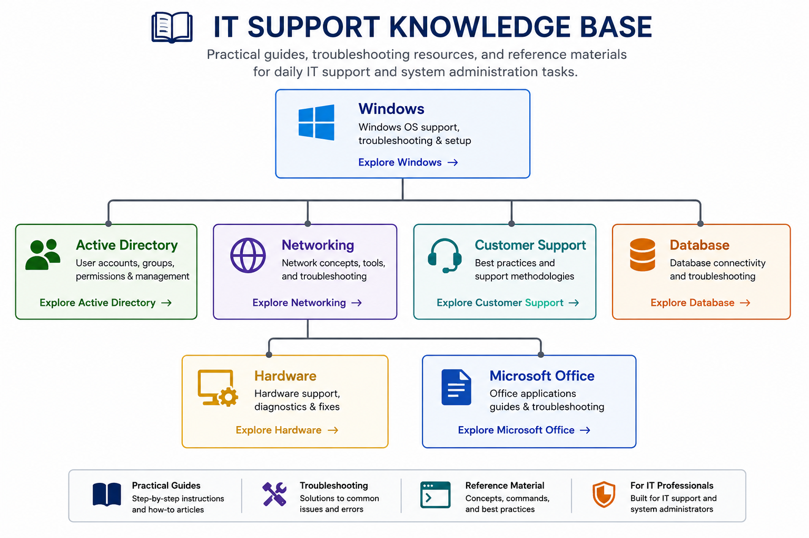

# IT Support Knowledge Base

A practical collection of IT support documentation, troubleshooting guides, and technical reference material developed while refreshing and strengthening my IT support skills.

<p align="center">
  
</p>

---

## Browse the Knowledge Base

### 🖥️ Windows

**Installation & Configuration**

* [Microsoft Office Installation](windows/office-installation.md)

**Troubleshooting**

* [Windows Troubleshooting](windows/windows-troubleshooting.md)

---

### 👥 Active Directory

* [What is Active Directory?](active-directory/user-account-management.md#what-is-active-directory)
* [Why is Active Directory Important?](active-directory/user-account-management.md#why-is-active-directory-important)
* [Common Active Directory Objects](active-directory/user-account-management.md#common-active-directory-objects)

**Common IT Support Tasks**

* [Password Reset](active-directory/user-account-management.md#password-reset)

* [Account Lockout](active-directory/user-account-management.md#account-lockout)

* [Updating User Information](active-directory/user-account-management.md#updating-user-information)

* [Managing Group Membership](active-directory/user-account-management.md#managing-group-membership)

* [Organizational Units (OUs)](active-directory/user-account-management.md#organizational-units-ous)

* [User Account Lifecycle](active-directory/user-account-management.md#user-account-lifecycle)

* [Best Practices](active-directory/user-account-management.md#best-practices)

---

### 🌐 Networking

**Fundamentals**

* [DNS and DHCP Fundamentals](networking/dns-and-dhcp.md)
* [IP Addressing Fundamentals](networking/ip-addressing-fundamentals.md)

**Troubleshooting**

* [Network Troubleshooting](networking/network-troubleshooting.md)
* [Network Diagnostic Tools](networking/network-diagnostic-tools.md)

---

### 💬 Customer Support

* [IT Troubleshooting Methodology](customer-support/troubleshooting-methodology.md)

---

### 🗄️ Database

* ODBC & SQL Server Connectivity

---

### 🖨️ Hardware

* Hardware Troubleshooting

---

### 📄 Microsoft Office

* Outlook Troubleshooting
* Excel Basics
* Word Basics
* PowerPoint Basics

---

## Repository Structure

```text
IT-Support-Knowledge-Base/
├── active-directory/
├── assets/
├── customer-support/
├── database/
├── hardware/
├── microsoft-office/
├── networking/
├── windows/
└── README.md
```

---

## About

This repository documents my journey of refreshing and strengthening my IT support knowledge after a career break. As I revisited core concepts, practiced troubleshooting, and explored current technologies, I organized my notes, procedures, and reference material into a structured knowledge base.

The guides in this repository reflect that learning process and serve as a practical reference for Windows administration, networking, Active Directory, Microsoft Office, desktop support, and IT troubleshooting.

---

## AI Disclosure

AI was used to assist with drafting this documentation and creating diagrams. All content has been reviewed, verified, and organized by me as part of my learning and skill refresh.

---

## License

This project is licensed under the MIT License.
