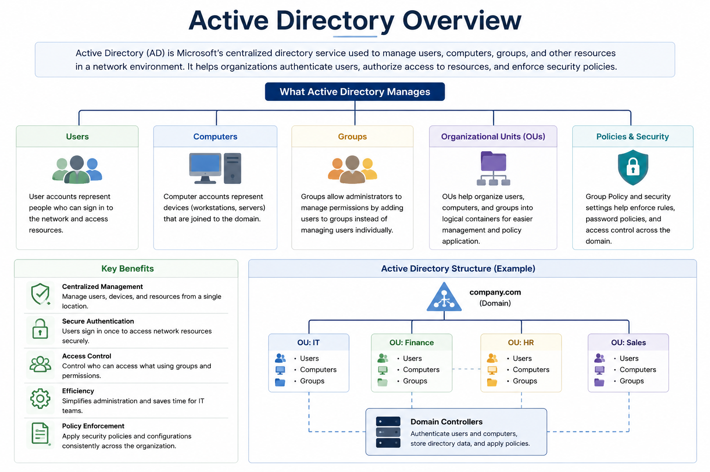
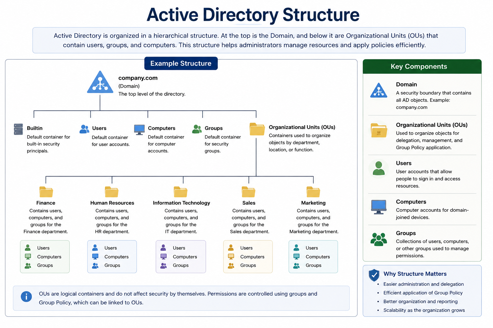

# Active Directory User Account Management

## What is Active Directory?

Active Directory (AD) is Microsoft's centralized directory service used to manage users, computers, groups, and other network resources within an organization.

Instead of managing accounts on individual computers, administrators use Active Directory to authenticate users, control access to resources, enforce security policies, and simplify system administration.

---

## Active Directory Overview



> **Quick Tip:** Active Directory provides a centralized way to manage identities, devices, permissions, and security policies across an organization's network.

---

## Why is Active Directory Important?

Active Directory helps organizations:

* Centralize user and computer management
* Authenticate users securely
* Control access to shared resources
* Apply security policies using Group Policy
* Simplify onboarding and offboarding
* Improve security and administrative efficiency

---

## Common Active Directory Objects

| Object                       | Description                                                     |
| ---------------------------- | --------------------------------------------------------------- |
| **User**                     | Represents an employee or user account.                         |
| **Computer**                 | Represents a domain-joined workstation or server.               |
| **Group**                    | Used to assign permissions to multiple users at once.           |
| **Organizational Unit (OU)** | Organizes users, computers, and groups into logical containers. |
| **Domain**                   | A security boundary that contains Active Directory objects.     |

---

## Example Active Directory Structure



> **Quick Tip:** Most organizations organize Active Directory by department, location, or business function using Organizational Units (OUs). This structure simplifies administration and allows administrators to apply different security policies where needed.

---

## Common IT Support Tasks

Common user account management tasks include:

* Creating user accounts
* Resetting passwords
* Unlocking accounts
* Updating user information
* Enabling or disabling accounts
* Managing group memberships
* Moving users between Organizational Units (OUs)
* Verifying account properties and permissions

---

## Password Reset

Password resets are one of the most common IT support requests.

Typical process:

1. Verify the user's identity.
2. Reset the password.
3. Require a password change at the next sign-in (if applicable).
4. Confirm the user can successfully sign in.

---

## Account Lockout

Accounts may become locked after multiple unsuccessful sign-in attempts.

Common causes include:

* Incorrect password
* Cached credentials
* Password changed on another device
* Mobile devices repeatedly using an old password

Typical resolution:

* Verify the cause of the lockout.
* Unlock the account if appropriate.
* Confirm successful sign-in.

---

## Updating User Information

IT support may update user account information such as:

* Display name
* Job title
* Department
* Office location
* Phone number
* Manager
* Email-related attributes (where applicable)

Maintaining accurate directory information improves communication and administration.

---

## Managing Group Membership

Security groups simplify permission management by assigning permissions to groups instead of individual users.

Common tasks include:

* Adding users to groups
* Removing users from groups
* Verifying memberships
* Confirming access after changes

---

## Organizational Units (OUs)

Organizational Units (OUs) organize Active Directory objects by department, location, or business function.

Example:

```text id="bb6nnb"
Company
│
├── Finance
├── Human Resources
├── Information Technology
├── Sales
└── Marketing
```

OUs simplify administration, delegation, and Group Policy management.

---

## Employee Lifecycle

A typical user account lifecycle includes:

1. Create the account.
2. Assign the appropriate OU.
3. Add required security groups.
4. Verify resource access.
5. Update account information as needed.
6. Disable the account when employment ends.

---

## Best Practices

* Verify user identity before making account changes.
* Follow the principle of least privilege.
* Document significant account modifications.
* Use security groups instead of assigning permissions directly to users.
* Disable accounts rather than deleting them when employees leave.
* Follow organizational security and change management policies.


