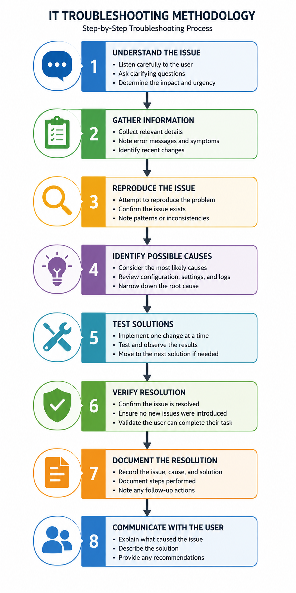

# IT Troubleshooting Methodology

## Purpose

This document outlines a structured approach for diagnosing and resolving technical issues in an IT support environment. Following a consistent process helps reduce resolution time, improve documentation, and provide a better support experience for end users.

---

## Guiding Principles

* Listen carefully to the user's description of the issue.
* Gather facts before making changes.
* Test one change at a time.
* Verify the solution before closing the request.
* Document the resolution for future reference.

---

# Standard Troubleshooting Process

## Step 1 – Understand the Issue

Ask questions to understand the problem.

Examples:

* What are you trying to do?
* What exactly happens?
* When did the issue begin?
* Has anything changed recently?
* Does the issue happen every time?

---

## Step 2 – Gather Information

Collect relevant details before making changes.

Examples:

* Device name
* Operating system
* Error messages
* Screenshots
* Recent software installations
* Network connection
* User permissions

---

## Step 3 – Reproduce the Issue

Whenever possible:

* Repeat the user's steps.
* Confirm the issue can be reproduced.
* Note any patterns or inconsistencies.

---

## Step 4 – Identify Possible Causes

Consider the most likely causes first.

Examples:

* Incorrect configuration
* Software updates
* Network connectivity
* User permissions
* Hardware failure
* Application settings

---

## Step 5 – Test Solutions

Implement one change at a time.

Examples:

* Restart the application.
* Restart the computer.
* Verify network connectivity.
* Check system settings.
* Update drivers.
* Repair the application.
* Reinstall software if necessary.

---

## Step 6 – Verify Resolution

Confirm:

* The original issue is resolved.
* No new issues were introduced.
* The user can complete their task successfully.

---

## Step 7 – Document the Resolution

Record:

* Issue summary
* Root cause
* Troubleshooting steps performed
* Final resolution
* Any follow-up actions

Good documentation helps future technicians resolve similar issues more efficiently.

---

## Step 8 – Communicate with the User

Provide a clear explanation of:

* What caused the issue
* What was done to resolve it
* Any steps the user should take in the future

Avoid unnecessary technical jargon whenever possible.

---

# Example Workflow

| Step               | Example                                         |
| ------------------ | ----------------------------------------------- |
| Reported Issue     | User cannot open Outlook                        |
| Gather Information | Error message, recent changes, network status   |
| Investigate        | Verify Outlook profile and mailbox connectivity |
| Resolution         | Repair Outlook profile                          |
| Verification       | User successfully sends and receives email      |
| Documentation      | Record root cause and corrective action         |

---

# Best Practices

* Keep the user informed during troubleshooting.
* Make changes in a controlled manner.
* Escalate issues when appropriate.
* Protect sensitive information.
* Follow organizational policies and security procedures.

---

# Related Articles

* Windows Troubleshooting Guide
* Microsoft Office Installation
* Active Directory User Account Management
* Network Troubleshooting
* Printer Troubleshooting
