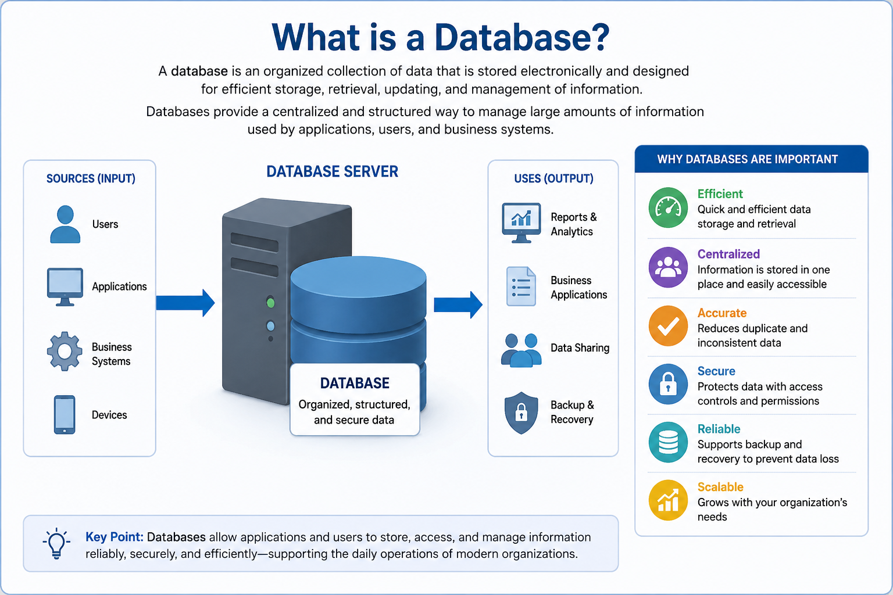
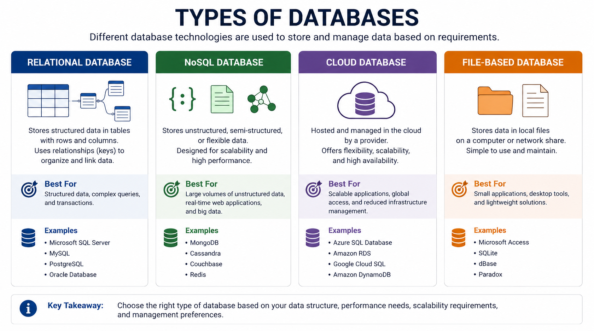
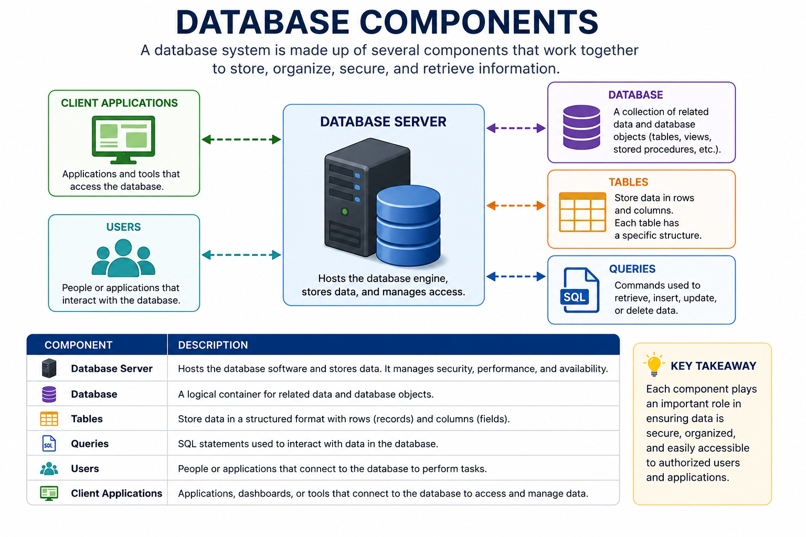
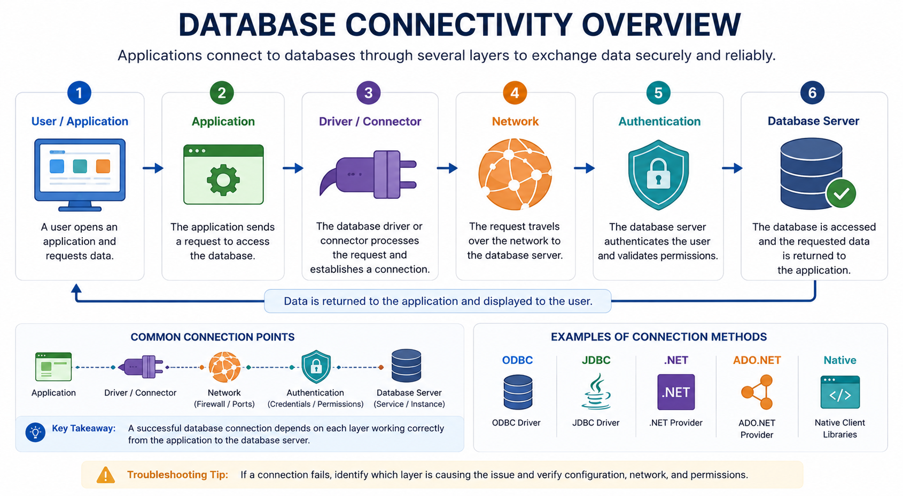

# Database Fundamentals

## What is a Database?

A database is an organized collection of data that is stored electronically and designed for efficient storage, retrieval, updating, and management of information. Instead of storing data in multiple files or spreadsheets, databases provide a centralized and structured way to manage large amounts of information.

Organizations of all sizes rely on databases to support their daily operations. Common examples include customer relationship management (CRM) systems, inventory management, banking applications, healthcare systems, e-commerce platforms, and enterprise resource planning (ERP) software.

Databases help ensure that information is accurate, secure, and easily accessible by authorized users and applications.

> **Quick Tip:** A database serves as a centralized repository that securely stores, organizes, and provides access to information used by applications and users.

---

## Why are Databases Important?

Databases are the foundation of modern applications and business systems. They provide a reliable and secure way to store, organize, retrieve, and manage information used by employees, customers, and applications every day.

### Benefits of Databases

* Store large volumes of information
* Retrieve data quickly and efficiently
* Reduce duplicate and inconsistent data
* Improve data security
* Support backup and disaster recovery
* Enable reporting and analytics
* Scale with business growth

### Real-World Examples

| Application     | Information Stored                         |
| --------------- | ------------------------------------------ |
| Banking         | Customer accounts and transactions         |
| Healthcare      | Patient records and appointments           |
| E-commerce      | Products, orders, and customer information |
| Human Resources | Employee records and payroll               |
| Education       | Student records and grades                 |
| Microsoft 365   | User accounts and mailbox information      |

---

## Types of Databases

Different applications use different database technologies depending on their requirements.

> **Quick Tip:** Relational databases are the most common in enterprise environments, while NoSQL databases are often used for flexible or large-scale data storage.

| Database Type       | Description                                          | Examples                                |
| ------------------- | ---------------------------------------------------- | --------------------------------------- |
| Relational Database | Stores structured data in tables with relationships. | Microsoft SQL Server, MySQL, PostgreSQL |
| NoSQL Database      | Stores unstructured or semi-structured data.         | MongoDB, Cassandra                      |
| Cloud Database      | Hosted and managed in the cloud.                     | Azure SQL Database, Amazon RDS          |
| File-Based Database | Stores data locally in files.                        | Microsoft Access, SQLite                |

---

## Database Components

A database system consists of several components that work together to store, organize, secure, and retrieve information.

> **Quick Tip:** A database system consists of multiple components that work together to securely store, organize, and retrieve information.

| Component          | Description                                             |
| ------------------ | ------------------------------------------------------- |
| Database Server    | Hosts the database engine and stores data.              |
| Database           | Collection of related tables and objects.               |
| Tables             | Store data in rows and columns.                         |
| Records            | Individual rows of information.                         |
| Queries            | Retrieve, insert, update, or delete data.               |
| Client Application | Software that accesses the database.                    |
| Users              | People or applications that interact with the database. |

---

## Database Connectivity Overview

Applications communicate with databases through several layers that work together to establish secure and reliable connections.

A typical connection process is:

1. A user opens an application.
2. The application requests data.
3. A database driver or connector processes the request.
4. The database server authenticates the user.
5. The requested database is accessed.
6. Data is returned to the application.

> **Quick Tip:** Most connectivity issues occur between the application, database driver, network, authentication service, or database server. Understanding the connection flow helps identify where problems occur.

Understanding this process helps IT support professionals troubleshoot connection problems more efficiently by identifying where failures occur.

