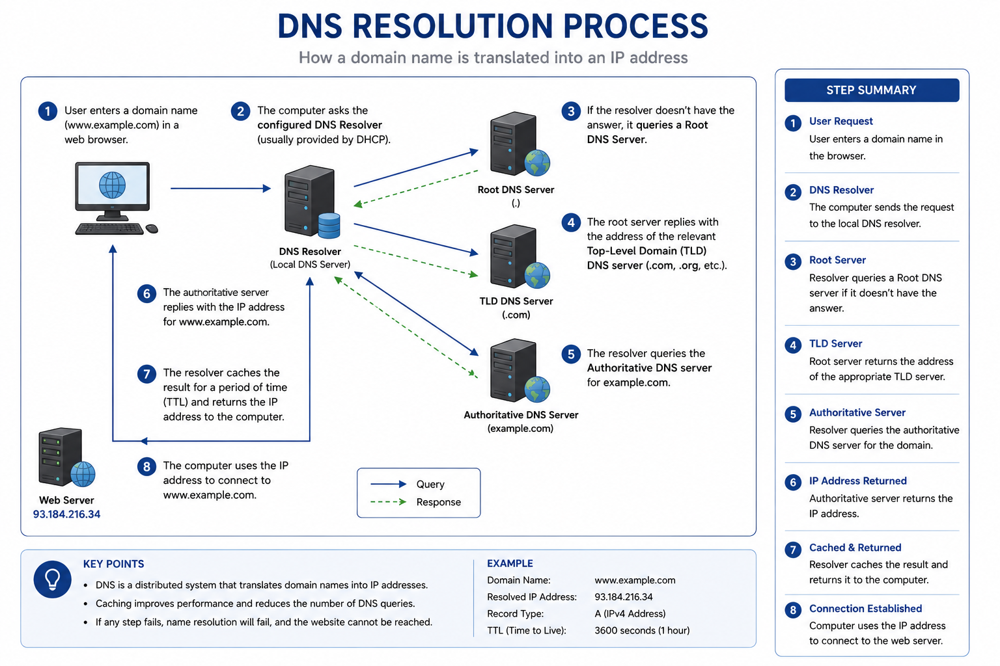
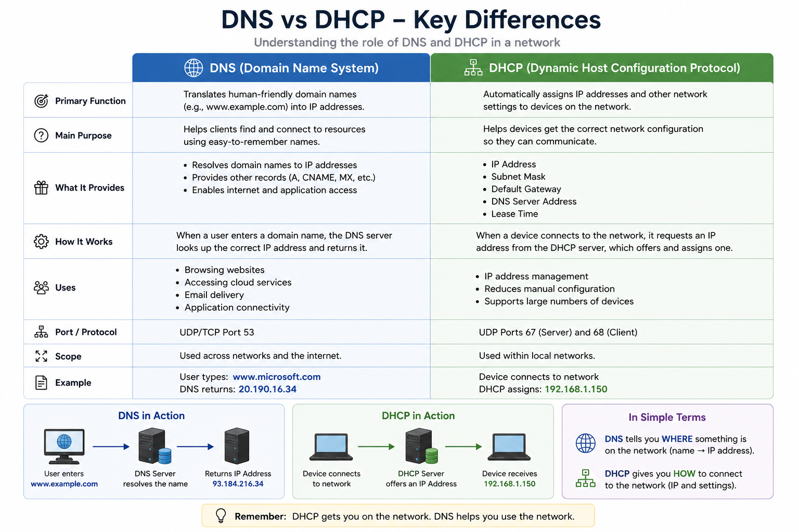
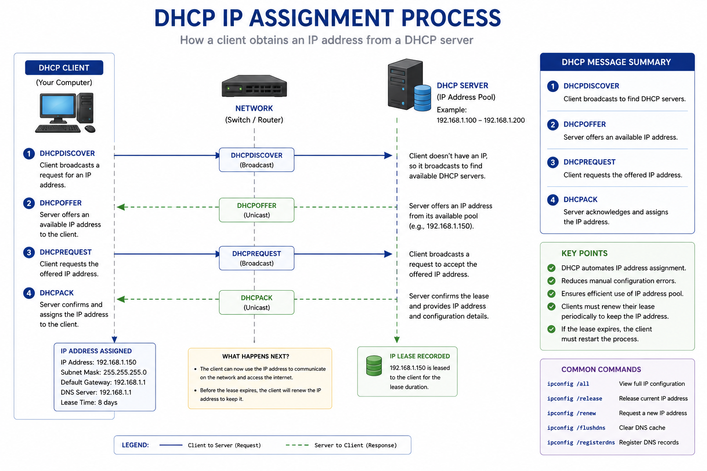

# DNS and DHCP Fundamentals

## Purpose

This guide explains the roles of Domain Name System (DNS) and Dynamic Host Configuration Protocol (DHCP) in Windows networks. It also provides troubleshooting steps for common DNS and DHCP-related issues encountered in desktop support.

---

## DNS Resolution Process




---

## DNS vs DHCP at a Glance



> **Quick Tip:** DHCP gives a device its network configuration (IP address, subnet mask, gateway, and DNS server). DNS uses that configuration to translate domain names (such as `www.microsoft.com`) into IP addresses so the device can communicate with resources on the network or internet.

---

## Overview

### What is DNS?

The **Domain Name System (DNS)** translates human-readable domain names into IP addresses.

Example:

```text
www.microsoft.com
        ↓
13.107.xxx.xxx
```

Without DNS, users would need to remember IP addresses instead of website names.

---

### What is DHCP?

**Dynamic Host Configuration Protocol (DHCP)** automatically assigns network settings to devices when they connect to a network.

Typical settings include:

* IP Address
* Subnet Mask
* Default Gateway
* DNS Server


## DHCP IP Assignment Process



Without DHCP, each device would need to be configured manually.

---

# How DNS and DHCP Work Together

1. A computer connects to the network.
2. DHCP assigns an IP address and other network settings.
3. The user enters a website address.
4. DNS translates the website name into an IP address.
5. The computer connects to the destination.

---

# Common DNS Issues

### Symptoms

* Websites do not open.
* "Server not found" errors.
* Applications cannot resolve hostnames.

### Troubleshooting

* Verify internet connectivity.
* Run:

```text
nslookup www.microsoft.com
```

* Flush the DNS cache:

```text
ipconfig /flushdns
```

* Verify DNS server configuration.
* Test using another DNS server if appropriate.

---

# Common DHCP Issues

### Symptoms

* No IP address assigned.
* Limited connectivity.
* IP address begins with **169.254.x.x** (Automatic Private IP Addressing).

### Troubleshooting

Run:

```text
ipconfig /release
ipconfig /renew
```

Verify:

* DHCP service is available.
* Network cable or Wi-Fi connection is working.
* Router or DHCP server is online.

---

# Useful Commands

| Command              | Purpose               |
| -------------------- | --------------------- |
| `ipconfig /all`      | View IP configuration |
| `ipconfig /release`  | Release current IP    |
| `ipconfig /renew`    | Request a new IP      |
| `ipconfig /flushdns` | Clear DNS cache       |
| `nslookup`           | Test DNS resolution   |
| `ping`               | Verify connectivity   |

---

# Example Scenarios

## Scenario 1 – User Cannot Browse the Internet

Investigation:

* Ping the default gateway → Success
* Ping `8.8.8.8` → Success
* Ping `www.microsoft.com` → Failed

Likely Cause:

DNS resolution issue.

---

## Scenario 2 – Laptop Receives 169.254.x.x Address

Investigation:

* `ipconfig /all` shows an APIPA address.
* Unable to ping the gateway.

Likely Cause:

The device could not obtain an IP address from the DHCP server.

---

# Best Practices

* Use DHCP for standard client devices.
* Document static IP assignments.
* Verify DNS settings before changing them.
* Restart networking equipment only after basic troubleshooting.
* Record command output when escalating issues.

---

# Related Articles

* Network Troubleshooting Guide
* Network Diagnostic Tools
* Cisco Wireless Basics
* Windows Troubleshooting Guide
