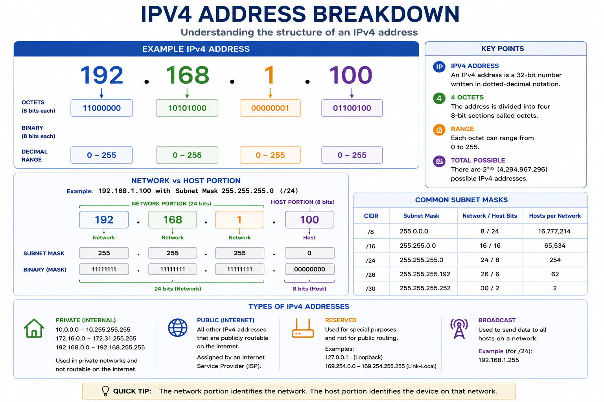
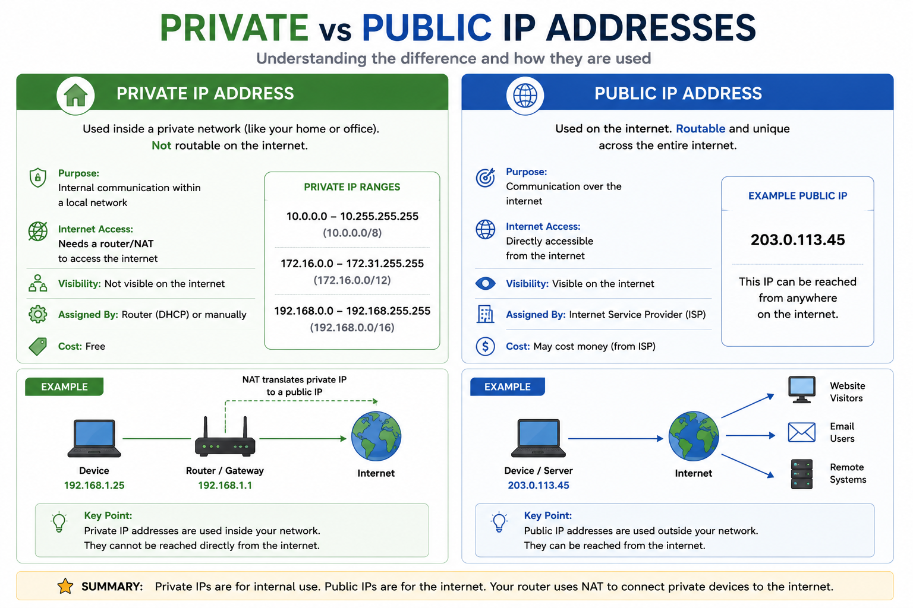
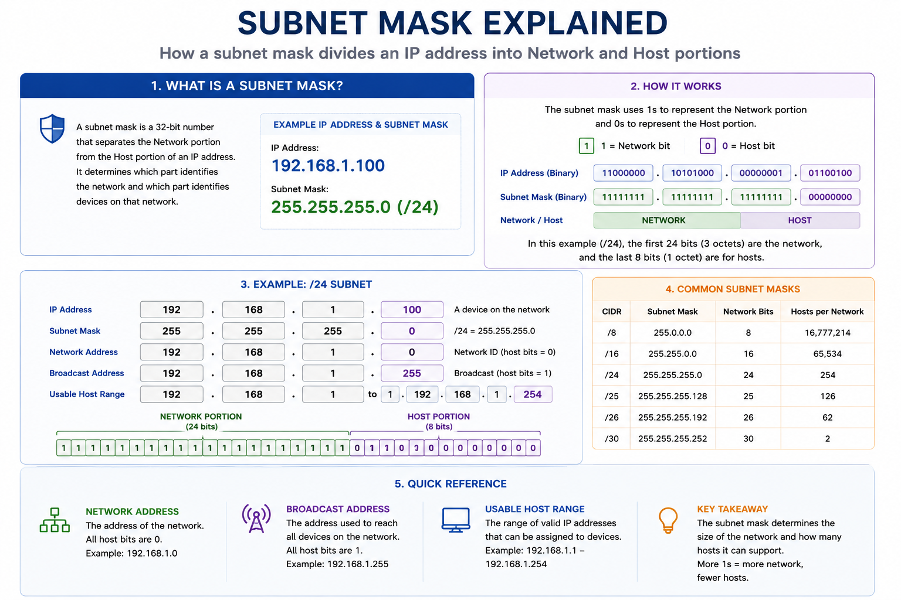
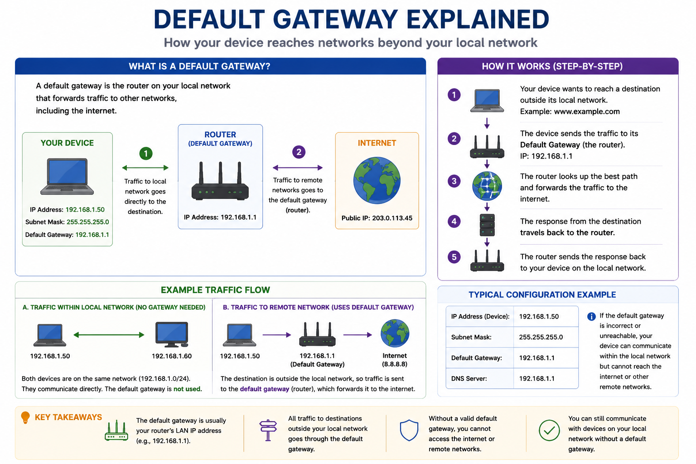
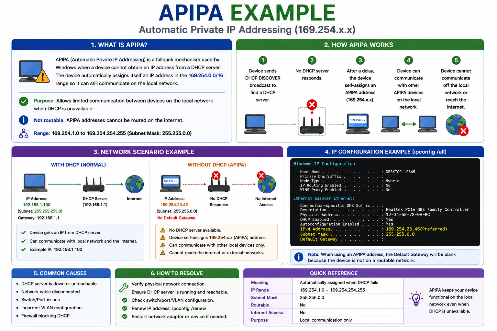

# IP Addressing Fundamentals

## Purpose

This guide explains the basics of IP addressing in Windows networks. It covers IPv4 addressing, subnet masks, default gateways, public vs. private IP addresses, and common troubleshooting scenarios encountered in desktop support.

---

## IPv4 Address Overview



---

## What is an IP Address?

An IP (Internet Protocol) address is a unique identifier assigned to a device on a network. It allows devices to communicate with each other and with resources on the internet.

Example IPv4 address:

```text
192.168.1.100
```

---

## IPv4 Address Structure

An IPv4 address consists of four numbers (octets) separated by periods.

Example:

```text
192.168.1.100
```

| Octet | Value |
| ----- | ----- |
| 1     | 192   |
| 2     | 168   |
| 3     | 1     |
| 4     | 100   |

Each octet ranges from **0–255**.

---

## Private IP Address Ranges

These address ranges are reserved for private networks.

| Network | Address Range                 |
| ------- | ----------------------------- |
| Class A | 10.0.0.0 – 10.255.255.255     |
| Class B | 172.16.0.0 – 172.31.255.255   |
| Class C | 192.168.0.0 – 192.168.255.255 |

These addresses are not directly accessible from the public internet.

---

## Public IP Addresses

A public IP address is assigned by an Internet Service Provider (ISP) and allows communication over the internet.

Typical home network:

```text
Internet
      │
Public IP
      │
Router
      │
Private Network
      │
192.168.1.x
```
---

## Private vs Public IP Comparison



> **Quick Tip:** Private IP addresses are used inside local networks and are not directly reachable from the internet. Public IP addresses are assigned by an Internet Service Provider (ISP) and are used for communication over the internet. Home and office routers use **Network Address Translation (NAT)** to allow multiple private devices to share a single public IP address.


---

## Subnet Mask

A subnet mask determines which portion of an IP address identifies the network and which portion identifies the device.

Common example:

```text
255.255.255.0
```

Typical small office network:

```text
Network:
192.168.1.0/24

Hosts:
192.168.1.1
192.168.1.2
192.168.1.3
...
192.168.1.254
```
---

## Understanding Subnet Masks



> **Quick Tip:** A subnet mask separates an IP address into two parts:
>
> - **Network portion** – identifies the network.
> - **Host portion** – identifies an individual device on that network.
>
> For a **/24** network (`255.255.255.0`), the first three octets identify the network and the last octet identifies the host.

---

## Default Gateway

The default gateway is the router that forwards traffic outside the local network.

Example:

```text
Computer
     │
192.168.1.100
     │
Default Gateway
192.168.1.1
     │
Internet
```

If the gateway is unreachable, users typically cannot access internet resources.

---

## Default Gateway in Action



> **Quick Tip:** Devices communicate directly with other devices on the same local network. When the destination is outside the local subnet (such as a website on the internet), the traffic is sent to the **default gateway**, which forwards it toward the correct destination.

### Common Default Gateway Issues

Typical symptoms include:

- Unable to browse the internet
- Can reach local devices but not external websites
- `ping` to the default gateway fails
- Incorrect gateway configured manually

When troubleshooting, verify the configured default gateway using:

```text
ipconfig /all
```

---

## DNS Server

The DNS server converts domain names into IP addresses.

Example:

```text
www.microsoft.com

↓

13.x.x.x
```

Without a working DNS server, websites may not load even though the internet connection is active.

---

## Automatic vs. Static IP Addresses

### DHCP (Automatic)

Advantages:

* Easy to manage
* Reduces configuration errors
* Automatically assigns addresses

Typical devices:

* Desktop computers
* Laptops
* Mobile devices

---

### Static IP

Advantages:

* Predictable address
* Required for many servers and network devices

Typical devices:

* Servers
* Network printers
* Firewalls
* Switches
* Routers

---

## APIPA Address

When a device cannot obtain an IP address from DHCP, Windows may assign an Automatic Private IP Address (APIPA).

Example:

```text
169.254.x.x
```

This usually indicates a DHCP communication problem.

---

## APIPA Troubleshooting Example



> **Quick Tip:** If you see an IP address in the **169.254.x.x** range, Windows was unable to obtain an IP address from a DHCP server. Before assuming the network is down, verify:
>
> - The network cable or Wi-Fi connection is working.
> - The DHCP server is available.
> - The network adapter is enabled.
> - The router or switch is functioning properly.
>
> Try the following commands:
>
> ```text
> ipconfig /release
> ipconfig /renew
> ipconfig /all
> ```


---

## Common Troubleshooting Scenarios

### User Has No Internet

Check:

* IP address
* Default gateway
* DNS server
* Network cable or Wi-Fi connection

---

### Device Has APIPA Address

Possible causes:

* DHCP server unavailable
* Faulty network cable
* Wireless authentication issue

Recommended actions:

* Run:

```text
ipconfig /release
ipconfig /renew
```

* Verify DHCP server availability.
* Restart network equipment if appropriate.

---

## Helpful Commands

```text
ipconfig /all

ipconfig /renew

ipconfig /release

ping

tracert

nslookup
```

---

## Best Practices

* Use DHCP for client devices unless a static IP is required.
* Document static IP assignments.
* Avoid assigning duplicate IP addresses.
* Verify gateway and DNS settings before troubleshooting applications.

---

## Related Articles

* DNS and DHCP Fundamentals
* Network Troubleshooting Guide
* Network Diagnostic Tools
* Cisco Wireless Basics
* Windows Troubleshooting Guide
