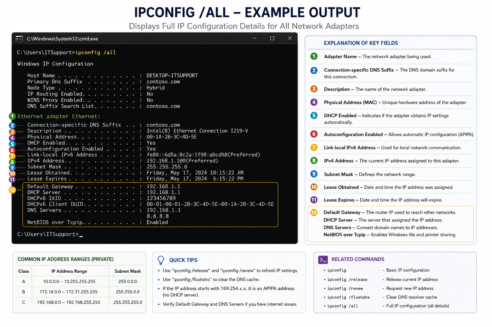
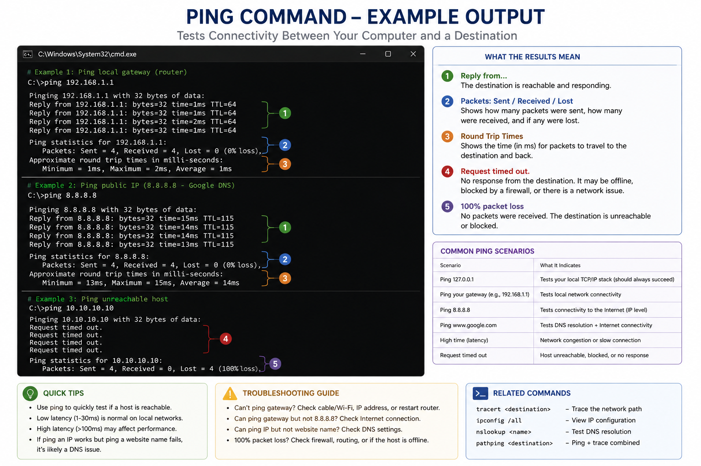
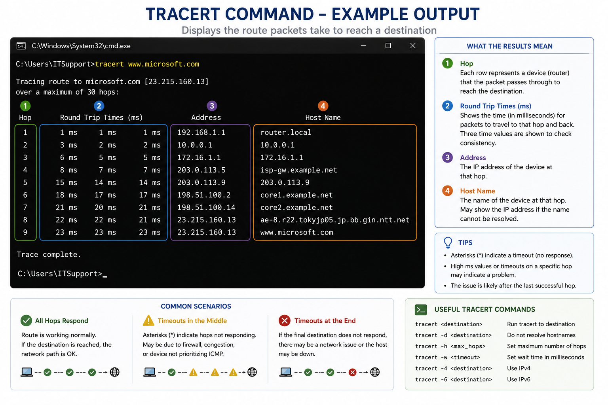

# Network Diagnostic Tools

## Purpose

This guide provides an overview of common Windows network diagnostic tools used to identify and troubleshoot connectivity issues. These tools help verify IP configuration, test communication between devices, diagnose DNS resolution problems, and trace network paths.

---

## When to Use

Use these tools when troubleshooting:

* No internet connection
* Slow network performance
* DNS resolution failures
* IP configuration issues
* Network path problems
* VPN connectivity issues
* Shared resource access problems

---

# ipconfig

## Purpose

Displays the current TCP/IP configuration for all network adapters.

### Common Commands

```text
ipconfig

ipconfig /all

ipconfig /release

ipconfig /renew

ipconfig /flushdns
```

### Typical Uses

* Verify IPv4 address
* Check subnet mask
* Verify default gateway
* Confirm DNS server configuration
* Release and renew DHCP leases
* Clear the local DNS cache

### Example



---

# ping

## Purpose

Tests communication between the local computer and another device on the network.

### Syntax

```text
ping <hostname>

ping <IP address>
```

### Typical Uses

* Test local network connectivity
* Verify gateway connectivity
* Test internet access
* Verify DNS resolution

### Example

```text
ping 192.168.1.1
ping 8.8.8.8
ping www.microsoft.com
```

### Example Output



---

# tracert

## Purpose

Displays the route packets take from the local computer to a destination.

### Syntax

```text
tracert www.microsoft.com
```

### Common Uses

* Identify where network communication stops
* Diagnose routing problems
* Measure latency across hops

## Example Output



---

# nslookup

## Purpose

Queries DNS servers to verify name resolution.

### Syntax

```text
nslookup www.microsoft.com
```

### Typical Uses

* Verify DNS resolution
* Identify DNS server issues
* Confirm hostname-to-IP mapping

---

# netstat

## Purpose

Displays active network connections and listening ports.

### Common Commands

```text
netstat

netstat -a

netstat -ano
```

### Typical Uses

* View active TCP and UDP connections
* Identify listening ports
* Troubleshoot application connectivity
* Match connections to running processes

---

# arp

## Purpose

Displays and manages the Address Resolution Protocol (ARP) cache.

### Common Command

```text
arp -a
```

### Typical Uses

* View MAC address mappings
* Troubleshoot local network communication
* Verify neighboring devices

---

# pathping

## Purpose

Combines features of `ping` and `tracert` to identify packet loss and latency.

### Typical Uses

* Diagnose intermittent network issues
* Measure packet loss
* Identify unstable network segments

---

# Recommended Troubleshooting Sequence

1. Check IP configuration using `ipconfig /all`.
2. Ping the default gateway.
3. Ping a public IP address.
4. Ping a website using its hostname.
5. Run `nslookup` if DNS resolution fails.
6. Use `tracert` to identify routing issues.
7. Review active connections using `netstat`.

---

# Best Practices

* Verify physical connections before using command-line tools.
* Record command output when documenting issues.
* Compare results with a known working system when possible.
* Escalate persistent routing or ISP-related problems when appropriate.

---

# Related Articles

* Network Troubleshooting Guide
* Cisco Wireless Basics
* DNS and DHCP
* IP Addressing Fundamentals
