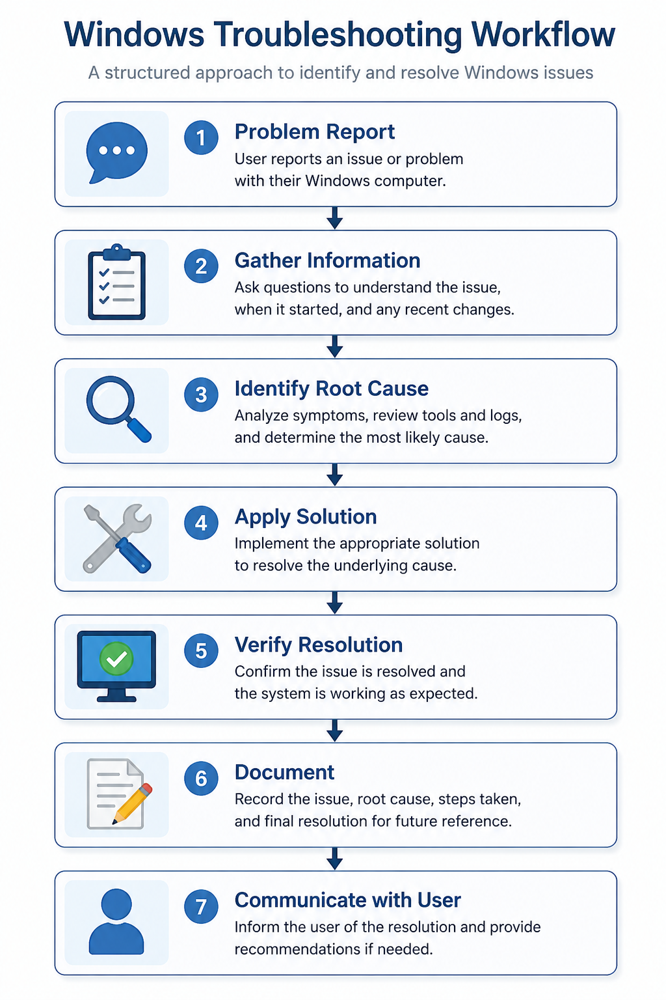
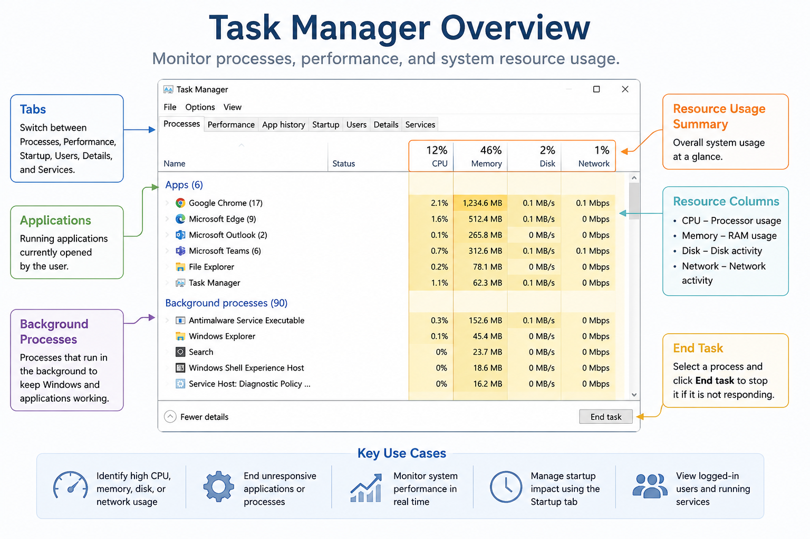

# Windows Troubleshooting

Windows troubleshooting is the systematic process of identifying, diagnosing, and resolving hardware, software, operating system, and network-related issues on Windows computers.

A structured troubleshooting approach helps IT support professionals minimize downtime, identify root causes efficiently, and restore normal system operation while providing a consistent support experience.


---

## Why is a Structured Troubleshooting Process Important?

Following a consistent troubleshooting methodology helps to:

* Resolve issues more efficiently
* Reduce unnecessary downtime
* Prevent repeated problems
* Improve documentation and knowledge sharing
* Increase customer satisfaction
* Ensure consistent support across the IT team

---



> **Quick Tip:** Following a structured troubleshooting process helps IT support professionals identify root causes efficiently, reduce downtime, and provide consistent support.

---

## Common Windows Issues

### Slow Computer

#### Common Causes

* High CPU utilization
* Insufficient memory (RAM)
* Too many startup applications
* Low disk space
* Malware or unwanted software
* Windows updates running in the background

#### Troubleshooting Steps

* Restart the computer.
* Review CPU, memory, and disk usage in Task Manager.
* Disable unnecessary startup applications.
* Delete temporary files.
* Verify available disk space.
* Install pending Windows updates.
* Run a Windows Security or antivirus scan.

---

### Windows Update Failure

#### Common Causes

* Network interruption
* Corrupted update files
* Insufficient storage
* Windows Update service issue

#### Troubleshooting Steps

* Restart the computer.
* Retry Windows Update.
* Verify internet connectivity.
* Free disk space if necessary.
* Restart Windows Update services.
* Run the Windows Update Troubleshooter.

---

### Blue Screen (BSOD)

#### Common Causes

* Faulty device drivers
* Hardware failure
* Memory issues
* Corrupted system files
* Recent hardware or software changes

#### Troubleshooting Steps

* Record the stop code.
* Restart the computer.
* Review Device Manager for driver issues.
* Run Windows Memory Diagnostic.
* Run:

```text
sfc /scannow
```

* Review Event Viewer logs.
* Update or roll back device drivers if necessary.

---

### Computer Will Not Start

#### Common Causes

* Power issue
* Boot configuration problem
* Corrupted operating system
* Failed hardware

#### Troubleshooting Steps

* Verify power connections.
* Check the monitor and display cables.
* Disconnect unnecessary peripherals.
* Boot into the Windows Recovery Environment (WinRE).
* Run Startup Repair.
* Review BIOS/UEFI boot settings if necessary.

---

### No Internet Connection

#### Common Causes

* Wi-Fi disconnected
* Disabled network adapter
* Incorrect IP configuration
* DNS issue
* Router or ISP outage

#### Troubleshooting Steps

* Verify Wi-Fi or Ethernet connectivity.
* Restart the computer.
* Restart the router or modem.
* Disable and re-enable the network adapter.
* Run the Windows Network Troubleshooter.
* Test connectivity using:

```text
ipconfig /all
ping
```

---

### Printer Not Responding

#### Common Causes

* Printer offline
* Print Spooler service stopped
* Incorrect default printer
* Driver issue
* Network connectivity problem

#### Troubleshooting Steps

* Verify printer power and network connection.
* Restart the Print Spooler service.
* Clear the print queue.
* Verify the correct default printer.
* Reinstall or update the printer driver.
* Print a test page.

---

## Windows Troubleshooting Tools

Windows includes several built-in tools that help identify and resolve common issues.

| Tool            | Purpose                                                           |
| --------------- | ----------------------------------------------------------------- |
| Task Manager    | Monitor applications, processes, and system performance.          |
| Device Manager  | Identify hardware and driver issues.                              |
| Event Viewer    | Review application, system, and security logs.                    |
| Services        | Manage Windows background services.                               |
| Disk Management | View and manage storage devices and partitions.                   |
| Windows Update  | Install security and feature updates.                             |
| Settings        | Configure Windows devices, accounts, network, and system options. |



> **Quick Tip:** Task Manager is often the first tool used to identify high CPU, memory, disk, or network usage, stop unresponsive applications, and monitor overall system performance.


---

## Command-Line Tools

Command-line utilities are frequently used by IT support professionals for diagnostics and troubleshooting.

| Command                                      | Purpose                                         |
| -------------------------------------------- | ----------------------------------------------- |
| `ipconfig /all`                              | Display detailed IP configuration.              |
| `ping`                                       | Test network connectivity.                      |
| `tracert`                                    | Trace the route to a destination.               |
| `nslookup`                                   | Verify DNS name resolution.                     |
| `systeminfo`                                 | Display system information.                     |
| `hostname`                                   | Display the computer name.                      |
| `sfc /scannow`                               | Scan and repair corrupted Windows system files. |
| `DISM /Online /Cleanup-Image /RestoreHealth` | Repair the Windows system image.                |
| `chkdsk`                                     | Scan and repair disk errors.                    |

> *(Insert **windows-repair-commands.png** here.)*

---

## Verification

After troubleshooting:

* Confirm the original issue has been resolved.
* Verify the user can complete their task successfully.
* Check for any remaining warning or error messages.
* Monitor the system if necessary.
* Document the root cause, actions taken, and final resolution.

---

## User Communication

After resolving the issue, communicate clearly with the user.

**Example:**

> The issue has been resolved and the system has been tested successfully. Please continue using the computer as normal. If the issue returns or you experience any additional problems, please contact the IT support team for further assistance.

---

## Best Practices

* Follow a structured troubleshooting process.
* Start with the simplest possible solution.
* Test one change at a time.
* Verify the solution before closing the ticket.
* Document troubleshooting steps and outcomes.
* Escalate issues when appropriate.
* Keep Windows, drivers, and security software up to date.


